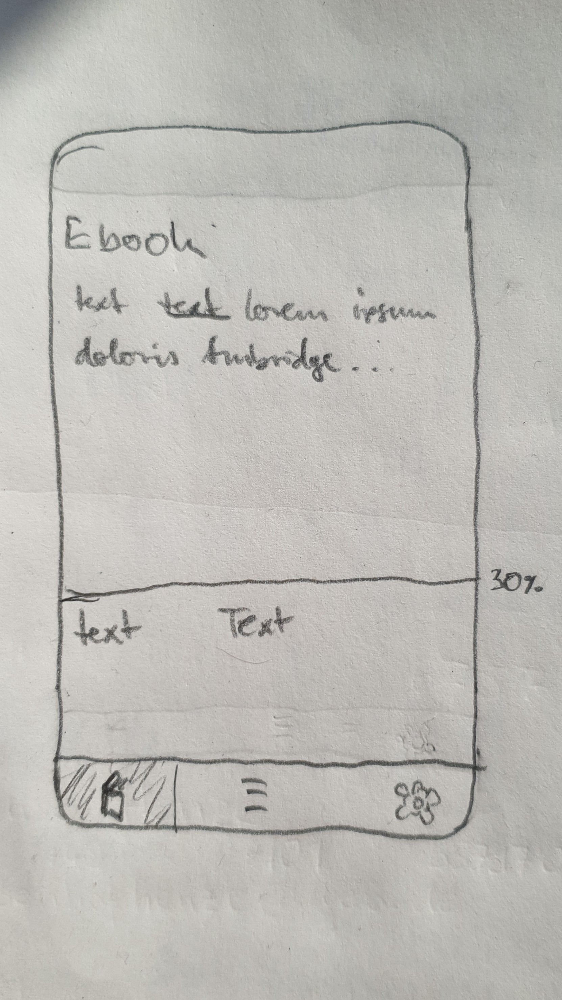
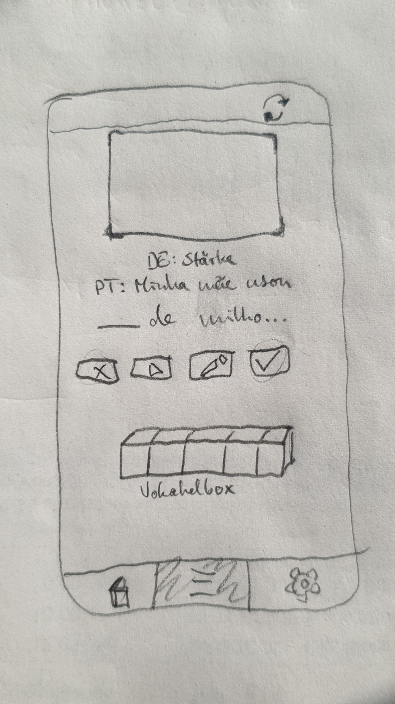

# Download
[Releases](https://github.com/avenaradio/lerlingua/releases)
# Connect with GitHub for synchronization
1. Create a GitHub repository
2. Create a personal access token
   - Click on your GitHub profile 
   - Go to Settings
   - Developer Settings
   - Personal Access Tokens
   - Fine-grained tokens
   - Generate new token
      - Set 'Token name'
      - Set 'Expiration' date
      - Select 'Only select repositories'
      - Select the repository you created
      - Click Repository permissions
      - For 'Contents' select 'read & write'
      - *Copy the token* you can't see it again
3. Add the token, repo owner and repo name to the app
During upload the file size is 1.34 times the file size on GitHub due base64 to the encoding.
# Lerlingua
Learn languages reading.

Lerlingua will be an app containing three main functions:
1. Reading ebooks
   - Minimalistic ebook reader
   - 1st click translation (webview)
   - 2nd click add vocabulary
2. Learn vocabulary
   - Vocabulary box system
   - Cloze
3. Sync across devices (GitHub)

# Development:
- Developed using the flutter framework
- Testing
- Open source
- No server costs

# Wireframes:
Reading:

Learning:


# Tools:
## Rename App
[https://pub.dev/packages/rename](https://pub.dev/packages/rename)
```shell
flutter pub global activate rename
flutter pub global run rename setAppName --targets android,ios,web,windows,macos,linux --value "Lerlingua"
```
## Launcher Icons
[https://pub.dev/packages/flutter_launcher_icons](https://pub.dev/packages/flutter_launcher_icons)
Configuration in pubspec.yaml
```shell
dart run flutter_launcher_icons
```
